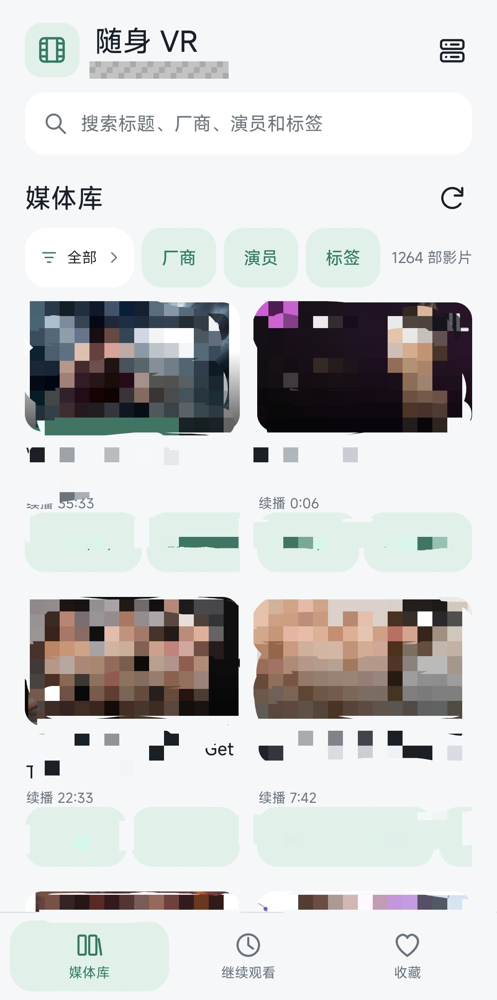
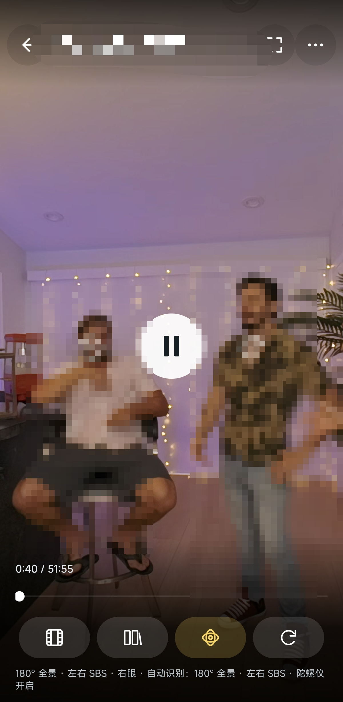

# XBVR-Mobile preview player

[中文](README.md) | [English](README.en.md)

[下载 APK](https://github.com/Singnight-apo/XBVR-Mobile-preview-player/releases/latest)

输入 XBVR 地址后浏览海报墙，在应用内播放普通视频和 VR 视频。VR 使用手机屏幕上的单眼投影视窗，支持拖动方向、双指缩放及可选方向传感器。应用采用原生 Android 界面、Media3 解码和 OpenGL ES 渲染。

本版为 **0.2.5** 开发版本，支持 Android 10 或更高版本。媒体库和设置跟随系统浅色／深色模式。APK 跟随系统语言：中文系统显示中文，其它系统语言显示英文；Android 13 及以上也可在系统设置中单独选择应用语言。分类、筛选入口和已选条件合并为一行；播放器主界面提供陀螺仪开关与重置视角，眼别移至格式面板，并修复全面屏遮罩的上下空隙。验证记录见 [VALIDATION.md](VALIDATION.md)。

## XBVR 原项目与致谢

播放器使用 [Google AndroidX Media3 / ExoPlayer](https://github.com/androidx/media) 1.8.0，承担媒体解码、播放状态、音轨与字幕选择；感谢其维护者和贡献者。Media3 使用 [Apache-2.0 许可证](https://github.com/androidx/media/blob/release/LICENSE)。VR 投影与触摸／陀螺仪视角由本项目的 OpenGL ES 渲染器实现。完整依赖列表见 [第三方说明](THIRD_PARTY_NOTICES.md)。

感谢 [XBVR 原项目](https://github.com/xbapps/xbvr) 提供媒体库和播放器接口。

本项目是独立开发的 Android 客户端，不是 XBVR 服务端仓库的 Git 历史 fork，也不是其官方客户端。媒体资源由用户自己的服务器提供，应用不内置影视内容。项目有权授权的原创代码和文档采用 [Apache-2.0](LICENSE)；第三方组件保留各自许可证。

<p>
  
  
</p>

## 安装与连接

1. 将标记为 **0.2.5** 的交付 APK 复制到手机／平板并打开安装；按系统提示允许当前文件管理器安装应用。已安装旧版时可直接覆盖安装：本次交付使用原签名，保留服务器配置、本机收藏与续播记录；无需先卸载。历史安装包另行保留。
2. 打开“XBVR 随身 VR”，输入手机可以访问的服务器地址，例如 `http://YOUR-XBVR-HOST:9999`。局域网连接需要手机与服务器之间可达。
3. 在 XBVR 中启用 DeoVR 接口，并为需要显示的播放列表开启播放器访问。当前海报墙使用 `/deovr` 目录，不能仅开启 HereSphere 后就期待目录可用。
4. 若 XBVR 设置了播放器账号，填写“播放器账号／密码”。若反向代理另外要求 HTTP Basic 认证，填写独立的“代理 HTTP Basic”字段。没有认证时留空。
5. 点击“保存并连接”，读取海报墙。可保存多台服务器，也可通过媒体库右上角的服务器图标选择或编辑配置。“代理认证设置”可展开独立的 HTTP Basic 字段。

地址可以带反向代理路径前缀，也可输入以 `/deovr` 或 `/heresphere` 结尾的地址，应用将规范化为服务器根前缀。HTTPS 使用正常证书校验；如果接口重定向到另一服务器，应用停止转发播放器凭据，需要填写最终的 XBVR 地址。

HereSphere 详情接口为可选补充，用于读取更完整的文件列表、时间标签、字幕和收藏权限；失败时回退到 DeoVR 详情。目录和媒体采用服务器返回的 URL，保留查询参数。多文件场景会尝试按实际所选文件读取 XBVR 文件级元数据；无法取得可靠格式时需要手动确认。

## 媒体库

- 封面完整显示，不再居中裁切。默认自动采用首次有效封面的原图比例；服务器菜单“封面比例”可选择自动、1:1、3:2、16:9，按服务器保存。不同尺寸的封面在统一卡片中等比完整显示，可能留边。手机至少两列，平板和宽屏自适应增加列数；卡片显示标题、时长、收藏标记与续播细条。
- 顶部搜索框匹配标题、厂商、演员和标签。分类切换保留 XBVR 各播放列表的原始顺序，包括按 added date 排序的自定义分类。
- 分类、厂商／演员／标签入口和已选条件共用一行，空间不足时左右滑动；影片数量显示在行尾。横屏不增加筛选行。
- 每张卡片显示可点击的厂商和演员；顶部可选择厂商、演员、标签。厂商和演员各单选，标签可多选并匹配任意所选标签，不同类型条件同时生效。选中条件可点击 × 取消，也可清除全部；再次点击相同厂商／演员亦可取消。筛选对话框支持搜索选项和清除此类。
- 目录先显示，元数据后台补充并按服务器缓存。优先读取只读 REST 列表，受限时回退 DeoVR 详情，不向 REST 接口发送播放器账号密码。信息不全时提示刷新；刷新重新补充元数据。
- 封面优先沿用 XBVR Web 图片代理，失败后尝试原图和备用封面。加载失败显示点击重试；图片下载限制12MB并缩小解码，封面仍完整等比显示。
- 底部“媒体库／继续观看／收藏”分别显示全部影片、本机观看记录和本机收藏。选中的导航项以强调色显示；长按海报加入或取消本机收藏。
- 点击海报进入播放器，恢复所选文件及观看进度。返回媒体库时保留搜索、分类和浏览位置。
- 界面自动跟随系统浅色／深色模式，无需手动主题设置。切换主题或旋转屏幕保留查询、分类、已应用的筛选条件、浏览位置及正在输入的连接草稿，不因此重新请求目录。
- 加载、连接失败、搜索无结果、未观看和未收藏都有对应提示。目录缓存可在刷新失败时继续显示，播放仍需要服务器和媒体可达。

界面验收的预览海报与视频使用合成测试素材；应用不内置影视资源，实际内容来自你连接的 XBVR 媒体库。

## 播放界面

画面铺满播放器窗口，控制叠层保持暗色以便观看；媒体库和设置对话框跟随系统主题。顶部与底部渐变遮罩延伸至屏幕边缘，按钮和文字避开屏幕挖孔、刘海和系统手势区域。顶部返回／横竖屏／更多、中间播放控制及底部快捷设置分开排布。手机横屏时使用紧凑布局。

- 顶部：返回媒体库；横竖屏图标切换屏幕方向；“更多”打开播放设置。
- 中间：播放／暂停，以及左右两个按钮后退／前进 **10 秒**。拖动 VR 画面改变方向，双指缩放；双击画面左右区域也可后退／前进 10 秒。
- 底部：时间与进度条；一行四个纯图标快捷按钮：格式／文件／陀螺仪／重置，长按显示中英文提示。陀螺仪关闭为白色、成功开启为黄色，默认关闭；重置恢复方向和默认视场角。格式面板内选择投影、画面布局与观看眼别：SBS 为左眼／右眼，TB 为上眼／下眼，MONO 无需切换眼别。
- 控制显隐：轻点画面显示或隐藏控制；正常播放时约 **4.2 秒**自动隐藏。暂停、拖动进度条或设置对话框打开时不自动隐藏。
- 文件切换：保留当前进度与播放／暂停状态。应用不生成低分辨率文件，也不执行服务器转码。
- 返回或切后台：保存进度并释放解码与取流资源；返回媒体库后继续原浏览位置。

“更多”设置分为播放、视角和媒体三个分组：

| 设置 | 用途 |
| --- | --- |
| 时间标签 | 查看服务器返回的时间标签并跳转；没有标签时提示为空 |
| 播放速度 | 选择倍速 |
| 音轨与字幕 | 选择设备支持的媒体轨道；字幕需服务提供文件或媒体自身包含可用轨道 |
| 镜头校正 | 调整鱼眼圆心、半径、旋转与镜像；平面双目可调整打包比例 |
| 收藏 | 更改本机收藏，或在服务器允许时更改服务器收藏 |
| 从头播放 | 跳转至开头 |

进度约每 5 秒保存一次，并在暂停、退出或切后台时保存。本机记录按服务器和稳定的场景／文件标识区分，避免媒体 URL 查询参数变化造成续播记录分散。清除应用数据或卸载会删除本机服务器配置、收藏与观看记录。

## 播放失败诊断

若出现“播放未能启动”，点击“查看诊断 → 复制报告”。若仍直接退出桌面，重新打开应用，进入媒体库右上角服务器菜单，选择“播放诊断 → 复制报告”，将报告反馈给开发者。

报告在本机保存，包括设备、系统、应用版本、异常类型与堆栈、可取得的 GPU 阶段及系统退出原因；不保存异常消息或原始退出 trace，也不会自动上传。Java 异常保护不能保证阻止原生驱动进程崩溃。

## 投影与格式纠正

提供以下 7 类投影，每类都可选择 MONO、SBS 或 TB，共 21 种组合。单眼裁切在投影映射时完成。

| 投影 | 单目 MONO | 左右 SBS／LR | 上下 TB |
| --- | --- | --- | --- |
| 普通平面 | 支持 | 支持 | 支持 |
| 180° 等距柱状全景 | 支持 | 支持 | 支持 |
| 360° 等距柱状全景 | 支持 | 支持 | 支持 |
| 180° 等距鱼眼 | 支持 | 支持 | 支持 |
| 190° 等距鱼眼 | 支持 | 支持 | 支持 |
| 200° 等距鱼眼 | 支持 | 支持 | 支持 |
| 220° 等距鱼眼 | 支持 | 支持 | 支持 |

覆盖参考脚本的 13 个模式：`180_LR`、`FISHEYE_180_LR`、`FISHEYE_190_LR`、`FISHEYE_200_LR`、`FISHEYE_220_LR`、`360_LR`、`360_TB`、`180_MONO`、`360`、`FISHEYE_200`、`FISHEYE_220`、`SBS_MONO`、`NONE`。旧名称 `SBS_MONO` 表示平面 SBS 中取单眼显示。

识别使用已保存的手动设置，其次是可靠的所选文件元数据，再参考文件名中的镜头／布局标记。明确文件模式如 `360_tb` 不受场景的笼统布局覆盖；精确 `RF52`、`MKX200`、`MKX220`／`MKX22`、`VRCA220` 等标记可补充通用投影信息。未知格式会提示确认，并提供手动菜单；Cube、EAC 和未展开的 360° 前后双鱼眼尚不支持展开。

如果画面方向或投影不对，打开“格式”，先选择投影，再选择画面布局。修改投影不会重建网络播放器，保留进度和暂停状态。通过“恢复自动识别”取消手动格式覆盖。

“更多 → 镜头校正”可调整鱼眼单眼圆心、圆盘半径、旋转与水平镜像，并为每个文件保存。半径 1 表示单眼图像短边的一半，圆心使用 0～1 的单眼 UV 坐标。平面双目可选择全幅或半幅打包比例；明确 `FULL_SBS`／`FSBS`／`FULL_TB`／`FTB` 文件名会识别全幅，其余双目平面默认半幅，也可手动纠正。

190° 鱼眼使用 95° 镜头半视角；RF52 识别进入通用 190° 等距预设，**没有 RF5.2mm 专用镜头标定**。200°、220°同样使用通用等距模型，不声称已经完成特定镜头的非线性校正。

## 收藏与数据

本机收藏始终可用，不写服务器，可从底部“收藏”浏览。播放器“更多 → 收藏”菜单只有在 HereSphere 详情明确声明 `writeFavorite` 权限时才显示服务器收藏选项；仅在用户实际点击该选项后提交，并重新读取确认结果。服务器收藏的海报墙分组可通过刷新目录更新。

服务器账号与密码由 Android Keystore 密钥加密保存；应用不将凭据写入普通明文偏好。播放器 JSON 请求不跨服务器转发账号密码，代理 Basic 认证只添加到配置服务器的同源请求。应用没有视频删除、服务器设置修改或转码操作。

## 设备能力与已知边界

解码依赖设备的 Android 媒体编解码器。MP4／MKV 等容器中的编码、位深、分辨率与帧率仍须设备支持；遇到播放失败时，可从“文件”选择服务器已有的兼容版本。

8K 双目即使只显示一眼，也必须解码完整视频帧，不能通过裁切降低解码尺寸。高码率流还取决于网络速度和后端文件可读性。8K、高位深、HDR、长时间音画同步、真实手机／平板色彩以及物理方向传感器效果需分别实测。当前对识别出的 HDR 片源显示尚未完成色彩验收的提示，建议先使用 SDR 文件。

方向传感器默认关闭；设备没有支持的旋转向量传感器时仍可触摸操作。应用面向手机／平板单眼观看，没有 Quest／PICO 头显的双眼头显模式、空间交互或专用镜头自动标定。

## 从源码构建（Windows）

固定工具链：AGP **8.13.2**、Gradle **8.13**、JDK **17**、`compileSdk`／`targetSdk` **36**、`minSdk` **29**、Media3 **1.8.0**。源码包含 Gradle Wrapper，可联网下载 Gradle 和 Maven 依赖。

源码压缩包不包含本机构建工具链、用户目录数据、私密缓存、签名私钥或 `local.properties`。另一台电脑请准备 JDK 17、Android SDK Platform 36、Build Tools 36.0.0 与 Platform Tools，并接受 SDK 许可。建议解压到较短且不含空格的目录，例如 `<project-directory>`。

在项目根目录创建 `local.properties`，使用自己的 SDK 路径；正斜杠可避免 Windows 反斜杠转义：

```properties
sdk.dir=<YOUR_ANDROID_SDK_PATH>
```

在 PowerShell 中执行（将 JDK 路径替换为实际安装路径）：

```powershell
$env:JAVA_HOME = '<YOUR_JDK_17_PATH>'
.\build.ps1
```

默认执行 `assembleDebug`、`testDebugUnitTest` 和 `lintDebug`。只构建 APK 可执行：

```powershell
.\build.ps1 -Tasks assembleDebug
```

APK 输出位置为 `app\build\outputs\apk\debug\app-debug.apk`。`build.ps1` 在 `toolchain\debug.keystore` 不存在时生成开发签名，再用该签名构建。这是开发 APK，尚未配置商店发布签名。

**后续更新必须保留原构建主机的 `toolchain\debug.keystore`。** 新主机生成的签名与交付 APK 不同，不能覆盖安装原签名应用；卸载后重装会丢失本机数据。签名私钥不随源码压缩包提供。需要连续安装更新时，应由持有原签名的构建主机生成 APK，或另行妥善迁移原密钥。

安装了 Android Platform Tools 后，也可通过 USB 调试安装：

```powershell
adb install -r .\app\build\outputs\apk\debug\app-debug.apk
```

源码中的 `CoreTest` 检查协议、时间单位、稳定标识、格式识别和投影数学；`ApiSecurityTest` 使用本机 MockWebServer 检查重定向凭据隔离；渲染相关测试检验方向与比例计算。实际执行结果与模拟器／真机验证范围请以 [VALIDATION.md](VALIDATION.md) 为准。

## 许可

项目有权授权的原创部分采用 Apache-2.0；第三方代码、截图中的媒体及商标不在该授权范围内。详见 [许可范围](licenses/LICENSE_SCOPE.md)、[第三方通知](THIRD_PARTY_NOTICES.md)及[来源复核](docs/compliance/SOURCE_PROVENANCE.md)。

服务器菜单“开源许可”提供中英文入口，可离线阅读完整原文。desugar_jdk_libs 保留 GPLv2 + Classpath Exception，[对应版本源码](licenses/SOURCE_AVAILABILITY.md)与 APK 一同提供。历史参考的鱼眼用户脚本原文尚未找到，因此来源复核不作零复制保证。
